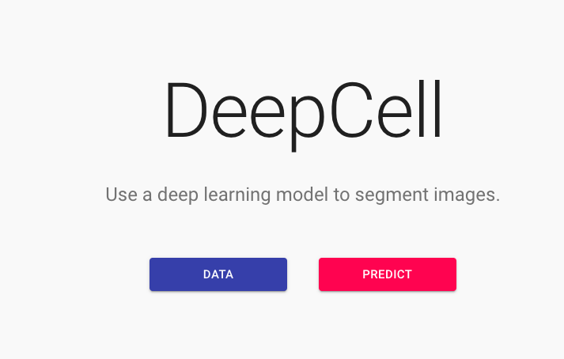
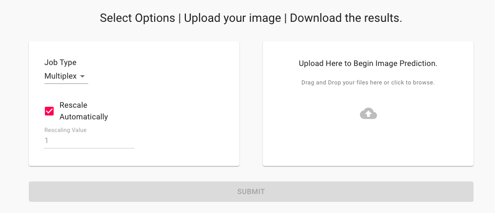
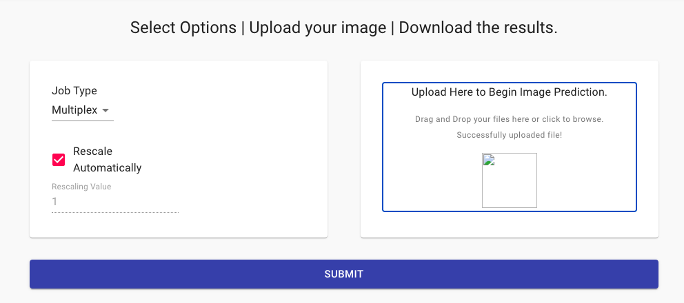
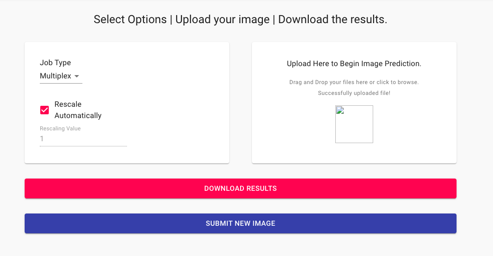

# Running pretrained models from the cloud

Deep learning models perform best when run on GPU hardware. However, having every lab purchase their own GPU is not reasonable or effecient. To help make it as easy as possible to run our deep learning models, we have created a number of different options for using our cloud-based servers to analyze data. This makes it easy for anyone to submit their images to be analyzed, without needing to worry about installing any complicated software or purchase any expensive hardware. 

To faciliate this, we created the [Kiosk](https://github.com/vanvalenlab/kiosk-console). DeepCell Kiosk provides an efficient and scalable way to analyze large volumes of data using cloud computing. By automatically adjusting resources based on usage, the Kiosk is able to quickly deliver results for large numbers of images when demand increases, while reducing costs by downscaling when demand decreases.

## Table of Contents

* [Formatting data for web-based models](#formatting-data-for-web-based-models)
* [Generating predictions with DeepCell.org](#generating-predictions-with-deepcellorg)
* [Generating predictions with ImageJ](#generating-predictions-with-imagej)

## Formatting data for web-based models

Each of the models we host has slightly different requirements for input data. Please identify which of the following models you will be using, and make sure your data is formatted appropriately. 

#### Multiplex Model

The multiplex model performs whole-cell segmentation of tissue imaging data. The input to the model is two-channel images. The first channel must be a nuclear channel (such as DAPI). The second channel must be a membrane or cytoplasmic channel (such as E-Cadherin).  

<table width="700" border="1" cellpadding="5">

<tr>
<td align="center" valign="center">
Input Data
</td>

<td align="center" valign="center">
Model Predictions
</td>
</tr>

<tr>
<td align="center" valign="center">

</td>

<td align="center" valign="center">

</td>
</tr>

</table>

#### Nuclear Segmentation Model

The nuclear segmentation model performs nuclear segmentation of cell culture images. The input to the model is a single channel nuclear image (such as DAPI).   

<table width="700" border="1" cellpadding="5">

<tr>
<td align="center" valign="center">
Input Data
</td>

<td align="center" valign="center">
Model Predictions
</td>
</tr>

<tr>
<td align="center" valign="center">

</td>

<td align="center" valign="center">

</td>
</tr>

</table>

## Generating predictions with DeepCell.org

Deepcell.org is a web-based interface to access our pre-trained deep learning models. The website allows you to easily upload example images, run them on our available models, and download the results without requiring any local installation.

### Submitting data to the website

Generating data from the website is quite easy.

1. Go to DeepCell.org, and click on `PREDICT`.  

2. This will take you to the image upload interface. The default model is `multiplex`. Before submitting your image, make sure you understand [the available models and data formatting requirements](#formatting-data-for-web-based-models). Upload your image by dragging it into the upload box, or by clicking and then browsing to find your image.  

3. Once your image has been successfully uploaded, click `Submit`, and the server will begin processing your data.  

4. Once complete, you can download the results, and then process additional images.  

## Generating predictions with ImageJ

The ImageJ plugin provides an easy interface to access our pre-trained deep learning models. Data is automatically uploaded to our server, processed, and then returned within ImageJ.

Before getting started, make sure you understand [the available models and data formatting requirements](#formatting-data-for-web-based-models).

### Installation

To install the ImageJ plugin, follow the [instructions](https://github.com/vanvalenlab/kiosk-imageJ-plugin#how-to-install).

### Generate predictions

To generate predictions using the plugin, follow the [instructions](https://github.com/vanvalenlab/kiosk-imageJ-plugin#how-to-run-the-plugin).
