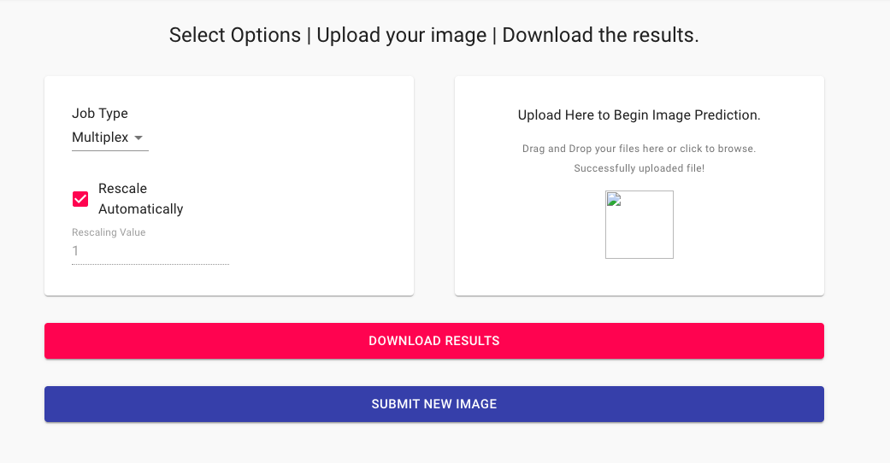

## Introduction to DeepCell.org
Deepcell.org is a web-based interface to access our pretrained deep learning models. The website allows you to easily upload example images, 
run them on our available models, and download the results without requiring any local installation. 

## Scalable cloud backend for efficient deployment of deep learning models
DeepCell.org is run by the [DeepCell Kiosk](https://github.com/vanvalenlab/kiosk-console). The Kiosk provides an effecient and scalable way to analyze 
large volumes of data using cloud computing. By automatically scaling up when useage increases and scaling down when useage decreases, the Kiosk
is able to quickly deliver results for large numbers of images when demand increases, while reducing costs by downscaling when demand decreases. 

## Submitting data to the website
Generating data from the website is extremely easy. 
1. Go to DeepCell.org, and click on `PREDICT`

2. This will take you to the image upload interface. The default model is `multiplex`. Before submitting your image, make sure you understand [the available models and data formatting requirements](models.md)

Upload your image by dragging it into the upload box, or by clicking and then browsing to find your image

3. Once your image has been succesfully uploaded, click `Submit`, and the server will begin processing your data.

4. Once complete, you can download the results, and then process additional images

