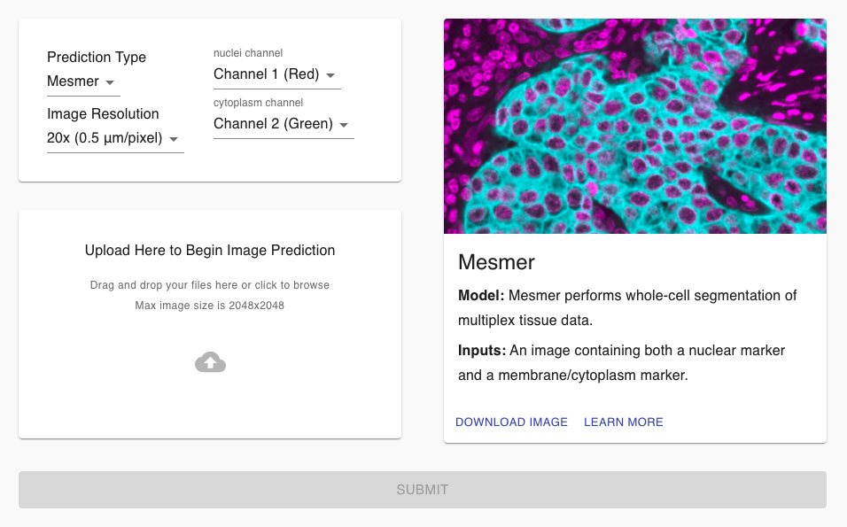
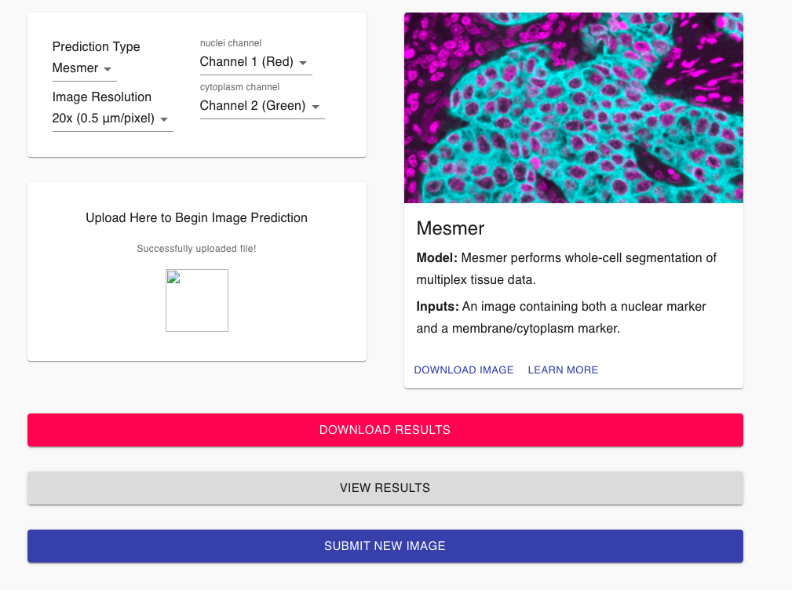

# Running pre-trained models

Deep learning models require large volumes of training data in order to perform well. Not all labs have the necessary datasets or expertise to train their own model for each experiment. We have created a suite of high-quality, pre-trained deep learning models that can be applied out of the box to different types of biological image data. Each model is designed for a specific task, including tissue imaging, cell culture, and tracking. 

We have provided a range of options to access these models. Please see below for a description of each model, as well as the different ways each can be used to analyze your data. 

## Table of Contents

* [Formatting data for pre-trained models](#formatting-data-for-pre-trained-models)
  * Mesmer segmentation model
  * Nuclear segmentation model
* [Running pre-trained models in the cloud](#running-pre-trained-models-in-the-cloud)
  * Deepcell.org
  * FIJI/ImageJ Plugin
* [Running pre-trained models locally](#running-pre-trained-models-locally)
  * Jupyter Notebook
  * Command line Docker image
  * Multiplexed imaging analysis pipeline

## Formatting data for pre-trained models

Each of the models we host has slightly different requirements for input data. Please identify which of the following models you will be using, and make sure your data is formatted appropriately.

### Mesmer segmentation model

The Mesmer model performs whole-cell segmentation of multiplexed tissue imaging data. 

Data format: The Mesmer model expects two channels of imaging data. The first channel must be a nuclear channel (such as DAPI). The second channel must be a membrane or cytoplasmic channel (such as E-Cadherin). If you did not acquire a membrane channel in a particular experiment, you can instead supply an empty channel and the model will default to nuclear segmentation for the nuclei in the image. 

Image types: The Mesmer model was trained on [TissueNet](https://datasets.deepcell.org/), and thus is optimized for segmenting multiplexed tissue samples. It will **not** perform well on data from other modalties, such as H&E, IHC, cell culture, etc. 

Image resolution: Specify the image resolution that is closest to the resolution your data was acquired at. 

Outputs: The Mesmer model produces two segmentation masks. The first segmentation mask contains the whole-cell predictions, and the second contains the nuclear predictions. Within the masks, each cell is assigned a unique integer value, with the pixels which belong to each cell being given that value. 

Note: The DeepCell.org predict page allows users to specify which channel is the nuclear channel and which is the membrane channel, thus supporting data that is not properly formatted. However, all of the other ways to access the Mesmer model (see [Running pre-trained models in the cloud](#running-pre-trained-models-in-the-cloud) and [Running pre-trained models locally](#running-pre-trained-models-locally)) expect the input data to be properly formatted. 

<table width="700" border="1" cellpadding="5">

<tr>
<td align="center" valign="center">
Input Data
</td>

<td align="center" valign="center">
Model Predictions
</td>
</tr>

<tr>
<td align="center" valign="center">

</td>

<td align="center" valign="center">

</td>
</tr>

</table>

### Nuclear segmentation model

The nuclear segmentation model performs nuclear segmentation of cell culture images. The input to the model is a single-channel nuclear image (such as DAPI).

<table width="700" border="1" cellpadding="5">

<tr>
<td align="center" valign="center">
Input Data
</td>

<td align="center" valign="center">
Model Predictions
</td>
</tr>

<tr>
<td align="center" valign="center">

</td>

<td align="center" valign="center">

</td>
</tr>

</table>

## Running pre-trained models in the cloud

Deep learning models perform best when run on accelerated hardware, such as GPUs. However, not every lab has the resources or desire to purchase and manage their own GPU-enabled workstations. To help make it as easy as possible to run our deep learning models, we have created a number of different options for using our cloud-based servers to analyze data. This makes it easy for anyone to submit their images to be analyzed, without needing to worry about installing any complicated software or purchase any expensive hardware.

To facilitate this, we created the [Kiosk](https://github.com/vanvalenlab/kiosk-console). DeepCell Kiosk provides an efficient and scalable way to analyze large volumes of data using cloud computing. By automatically adjusting resources based on usage, the Kiosk is able to quickly deliver results for large numbers of images when demand increases, while reducing costs by downscaling when demand decreases.

### Generating predictions with DeepCell.org

Deepcell.org is a web-based interface to access our pre-trained deep learning models. The website allows you to easily upload example images, run them on our available models, and download the results without requiring any local installation.

Generating data from the website is quite easy.

1. Go to [DeepCell.org](https://deepcell.org), and click on `PREDICT`.  

2. This will take you to the image upload interface. The default pipeline is `Mesmer`. Before submitting your image, make sure you understand [the available models and data formatting requirements](#formatting-data-for-pre-trained-models). This includes properly specifying the location of the nuclear and cytoplasm channel, as well as the resolution of your data. Upload your image by dragging it into the upload box, or by clicking within the box and then browsing to find your image. If you'd like to use our example image, click the 'Download Image' button. 

3. Once your image has been successfully uploaded, click `Submit`, and the server will begin processing your data.  

4. Once complete, you can either press Download to view the segmentations locally or press View to open DeepCell Label to view them interactively.  

### Generating predictions with ImageJ

The ImageJ plugin provides an easy interface to access our pre-trained deep learning models. Data is automatically uploaded to our server, processed, and then returned within ImageJ.

Before getting started, make sure you understand [the available models and data formatting requirements](#formatting-data-for-pre-trained-models).

#### Installation

To install the ImageJ plugin, follow the [instructions](https://github.com/vanvalenlab/kiosk-imageJ-plugin#how-to-install).

#### Generate predictions

To generate predictions using the plugin, follow the [instructions](https://github.com/vanvalenlab/kiosk-imageJ-plugin#how-to-run-the-plugin).

## Running pre-trained models locally

Although cloud-based deployments are convenient and lower the barrier to entry for new labs, the degree of customization and throughput is limited compared to running the models locally. For users with large volumes of imaging data or specific requirements, we have also made our models available to be run locally or via a cluster. 

### Jupyter notebook

The [deepcell-tf application](https://github.com/vanvalenlab/deepcell-tf/tree/master/notebooks/applications) notebooks provide an easy interface to run our pre-trained models. Please follow the instructions in the [deepcell-tf README](https://github.com/vanvalenlab/deepcell-tf/blob/master/README.md) to set up the repository, then select the application notebook that corresponds best to your specific use case. 

### Command line Docker image

For users who want to integrate one of our models with an existing image analysis workflow, we created a Docker image that can be directly called from the command line as part of a larger workflow. See the [README](https://github.com/vanvalenlab/deepcell-applications/blob/master/README.md) for instructions on getting started.

### Multiplex image analysis pipeline

For users who are specifically interested in analyzing multiplexed image data, our collaborators at the Angelo Lab have set up their own analysis pipeline which uses the DeepCell ecosystem for cell segmentation. See their [README](https://github.com/angelolab/ark-analysis) for instructions on getting started.
